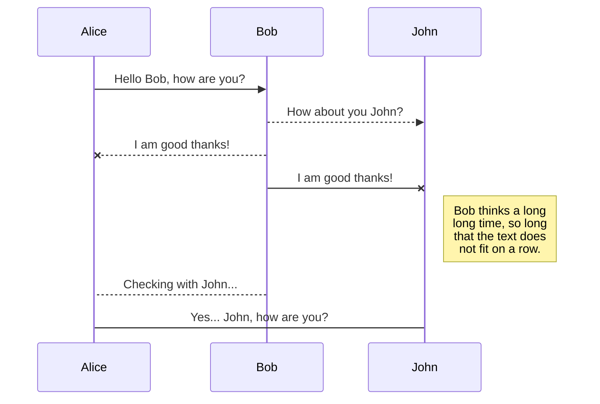

# GNIP ~ PING

Simple host checking application.
Check process is performed with *ICMP, TCP/IP* and *TRACE*.

## Usage
    java -jar gnip-app-1.0-jar-with-dependencies.jar [options]

#### Options
    -h          Help.
    -d          Run with default properties.
    -g          Generates an example properties file.
    -p file     Run with one specific properties file.

